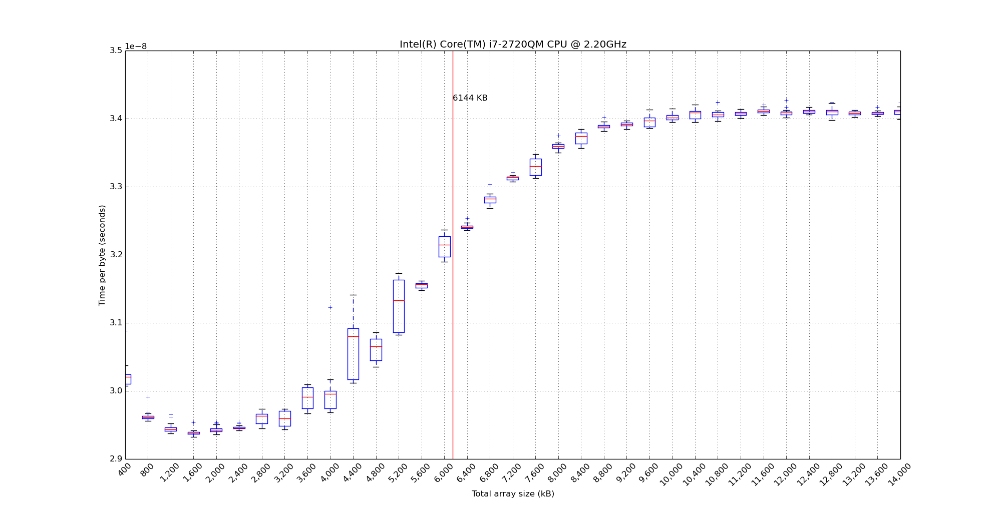
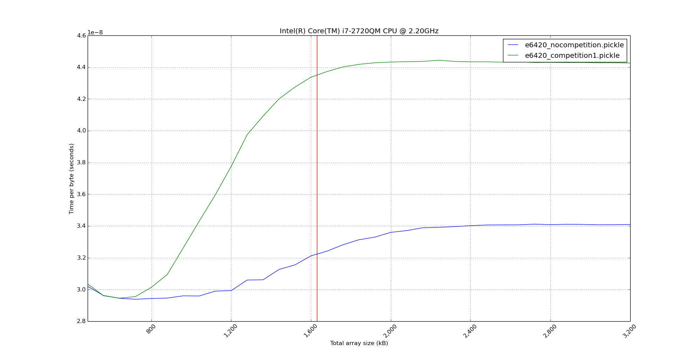

explore_cpu_cache_effect
========================

Understanding my CPU's L3 cache using numpy vectorized operations

The goal is to understand how numpy vectorized operations are affected by L3 cache sizes. An array of increasing length is investigated, an inplace operation is performed and the execution time on the array is recorded. The execution time is plotted against the number of bytes in the array as seen below.

The execution time is normalised to the number of bytes so if arbitrary length arrays 'cost' the same amount of time to process per byte, we'd see a flat line. Instead we see a sigmoid with higher costs for larger arrays.

To record the cache effect use:

    $ python measure_cache_effect.py --time <filename>  

To graph the output use:

    $ python measure_cache_effect.py --graph <filename1> [<filnameN>...]  

It'll generate a plot like the following for an unladen machine:

If you make two recordings under different situations you can compare them. In this case I'm comparing an unladen machine (nothing but this code running) with one of the recordings made when I ran this process twice simultaneoushly (which would make the L3 cache far more heavily used).

    $ python measure_cache_effect.py --graph <filename1> <filname2> --graphline

